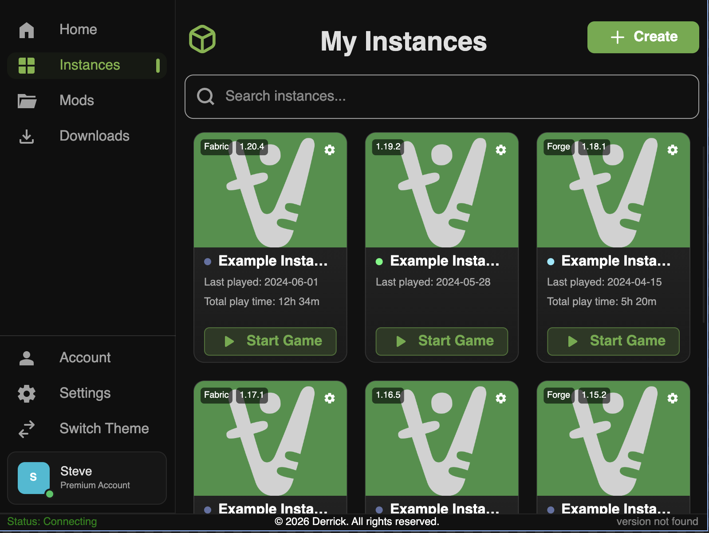

# VoxelRuler

> A Minecraft launcher built with Rust and a native GUI.

**🚧 Early Development — not yet usable for end users.**

---

## About

VoxelRuler is a cross-platform Minecraft launcher written in Rust, featuring a native desktop UI powered by [Slint](https://slint.dev/). It aims to support Microsoft account login, instance management, mod support, and more — all in a lightweight, fast application.



## Planned Features

- [ ] Microsoft account authentication (OAuth2)
- [ ] Instance management — create, launch, and organize Minecraft instances
- [ ] Mod support
- [ ] Download management
- [ ] Dark / light theme toggle

## Build from Source

**Prerequisites:**

- [Rust](https://rustup.rs/) (stable toolchain)
- A Microsoft Azure `client_id` with `XboxLive.signin` permissions

**Steps:**

```bash
git clone https://github.com/derrick921213/VoxelRuler.git
cd VoxelRuler
cargo build --release
./target/release/voxelruler <your_client_id>
```

## Tech Stack

| Component  | Technology                        |
|------------|-----------------------------------|
| Language   | Rust (2024 edition)               |
| GUI        | [Slint](https://slint.dev/) 1.16  |
| Async      | Tokio                             |
| UI Design  | Material Design (via Slint lib)   |
| Auth       | OAuth2 + Microsoft MSA            |

---

# VoxelRuler（繁體中文）

> 一款以 Rust 打造、具備原生 GUI 的 Minecraft 啟動器。

**🚧 早期開發中 — 目前尚不適合一般使用者使用。**

---

## 關於

VoxelRuler 是一款以 Rust 撰寫的跨平台 Minecraft 啟動器，使用 [Slint](https://slint.dev/) 建構原生桌面介面。目標功能包含 Microsoft 帳號登入、實例管理、模組支援等，追求輕量且快速的使用體驗。


## 計畫功能

- [ ] Microsoft 帳號驗證（OAuth2）
- [ ] 實例管理 — 建立、啟動與管理 Minecraft 實例
- [ ] 模組支援
- [ ] 下載管理
- [ ] 深色 / 淺色主題切換

## 從原始碼建置

**前置需求：**

- [Rust](https://rustup.rs/)（stable 工具鏈）
- 一組具備 `XboxLive.signin` 權限的 Microsoft Azure `client_id`

**步驟：**

```bash
git clone https://github.com/derrick921213/VoxelRuler.git
cd VoxelRuler
cargo build --release
./target/release/voxelruler <your_client_id>
```

## 技術堆疊

| 元件       | 技術                              |
|------------|-----------------------------------|
| 程式語言   | Rust（2024 版）                   |
| GUI        | [Slint](https://slint.dev/) 1.16  |
| 非同步執行 | Tokio                             |
| UI 設計    | Material Design（透過 Slint 函式庫）|
| 驗證       | OAuth2 + Microsoft MSA            |
